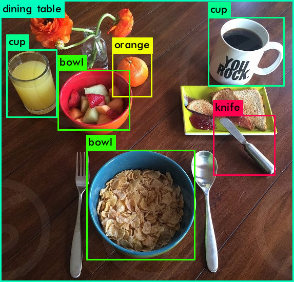

# YOLOv3 Darknet Training Setup

This guide will walk you through the process of setting up YOLOv3 with Darknet, downloading the necessary datasets, preparing them for training, and running the model to detect objects. Follow these steps to train your own YOLOv3 model.

## 1. Clone the Darknet Repository

Start by cloning the Darknet repository to your local machine.

```bash
git clone https://github.com/pjreddie/darknet
```

## 2. Compile Darknet

Navigate to the `darknet` directory and compile the code:

```bash
cd darknet
make
```

## 3. Download YOLOv3 Pre-trained Weights

Next, download the pre-trained YOLOv3 weights file:

```bash
wget https://pjreddie.com/media/files/yolov3.weights
```

## 4. Test YOLOv3 on a Sample Image

To test the initial YOLO model, use the following command with a sample image (`dog.jpg`):

```bash
./darknet detect cfg/yolov3.cfg yolov3.weights data/dog.jpg
```

This will display the bounding boxes on the image, and the processed image will be saved as `predictions.jpg`.

To view the result, run:

```bash
xdg-open predictions.jpg
```

## 5. Prepare the Dataset

### Switch to the Dataset Directory

Switch to the `data` directory:

```bash
cd ../data
```

### Create `images` Directory

Create a folder named `images` directory:

```bash
mkdir images
```

### Download the COCO Dataset

Download the training and validation image sets from the official COCO dataset:

```bash
wget http://images.cocodataset.org/zips/train2017.zip
wget http://images.cocodataset.org/zips/val2017.zip
```

These downloads might take some time, so be patient.

### Unzip the Image Files

Unzip the downloaded image files:

```bash
unzip train2017.zip
unzip val2017.zip
```

## 6. Download the COCO Annotations

Now, navigate back to the `data` directory and download the COCO annotations:

```bash
cd ..
wget http://images.cocodataset.org/annotations/annotations_trainval2017.zip
unzip annotations_trainval2017.zip
```

The annotations are in JSON format and need to be converted to the YOLOv3 format for training.

## 7. Set Up the Virtual Environment

### Create and Activate the Virtual Environment

Create a Python virtual environment and activate it:

```bash
python3 -m venv venv
source venv/bin/activate
```

### Install the Required Python Packages

Install the required Python dependencies from the `requirements.txt` file:

```bash
pip install -r requirements.txt
```

## 8. Convert Annotations to YOLO Format

Use the following Python script to convert the COCO annotations (in JSON format) to YOLOv3-compatible labels:

```bash
python3 convert-labels.py
```

This script will create a `labels` directory containing the converted label files.

## 9. Generate the Classes File

Next, create the `coco.names` file, which contains the class names of objects in the COCO dataset. Run:

```bash
python3 extract-classes.py
```

This will generate the `coco.names` file.

## 10. Create the `train.txt` and `val.txt` Files

The `train.txt` and `val.txt` files contain the paths to your training and validation images, respectively. Generate these files by running:

```bash
python3 create-paths-file.py
```

## 11. Train the YOLOv3 Model

Finally, with everything set up, you can begin training the YOLOv3 model on your dataset. Run the following command from the `darknet` directory:

```bash
cd ..
cd darknet
./darknet detector train ../data/coco.data cfg/yolov3.cfg yolov3.weights -map
```

This will start the training process. The `-map` flag displays the mean Average Precision (mAP) during training, allowing you to monitor the model's performance.

## 12. Test the Trained Model

To test the trained YOLOv3 model on a sample image, run the following command:

```bash
./darknet detector test ../data/coco.data cfg/yolov3.cfg backup/yolov3_final.weights ../data/test-images/breakfast-table.jpg
```

You can test the other images in the `data/test-images` directory by changing the image path in the command.
This will generate an output image with detected objects and save it as `predictions.jpg`. To view the result, use:

```bash
xdg-open predictions.jpg
```

Here is the result of running the model on the `breakfast-table.jpg` image:


